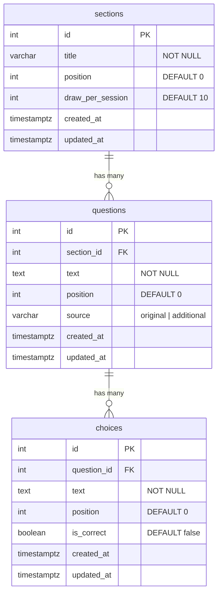

# PCAM 9 OJK — Quiz Practice & Question Bank

An internal exam-practice platform for the PCAM 9 (OJK) certification, covering Accounting, Financial Statement Analysis, and Risk Based Audit.

## Modules

| Module | Path | Description |
|---|---|---|
| Quiz Practice | `/quiz` | Student-facing exam: one question per screen, sidebar navigation, flag-for-review, autosave, review/submit, scored results |
| Question Bank | `/bank` | Read-only reference of all questions, filterable by section and source, with correct answers shown |
| Admin Panel | `/admin` | CRUD for sections, questions, and choices |
| Root | `/` | Redirects to `/quiz` |

## Tech Stack

- **Framework**: Next.js 15 (App Router) — deployed on Vercel
- **Database**: PostgreSQL via [Neon](https://neon.tech) (free tier)
- **DB client**: `@neondatabase/serverless` — raw SQL, no ORM
- **Styling**: Tailwind CSS v3 + inline styles for design token precision

## Getting Started

### 1. Clone and install

```bash
git clone <repo-url>
cd practice_website
npm install
```

### 2. Set up environment

Create `.env.local` in the project root:

```
DATABASE_URL=postgresql://...
```

Get the connection string from your [Neon dashboard](https://neon.tech).

### 3. Run the database migration

Paste `migration.sql` into the Neon SQL editor, or run:

```bash
export $(grep DATABASE_URL .env.local | xargs) && psql $DATABASE_URL -f migration.sql
```

The migration is idempotent — safe to run multiple times. On first run it:
- Creates the `sections`, `questions`, and `choices` tables
- Seeds 130 questions across 3 sections (115 original + 15 AI-generated)

### 4. Run locally

```bash
npm run dev
```

Open [http://localhost:3000](http://localhost:3000).

## Question Bank Content

| Section | Original | Additional (AI) | Total |
|---|---|---|---|
| Akuntansi | 32 | 5 | 37 |
| Analisis Laporan Keuangan | 17 | 5 | 22 |
| Risk Based Audit | 66 | 5 | 71 |
| **Total** | **115** | **15** | **130** |

**Source flag**: every question is tagged `original` (from class materials) or `additional` (AI-generated). The Question Bank shows a colored badge per question and a source filter row.

## API Endpoints

| Method | Path | Description |
|---|---|---|
| GET | `/api/quiz` | All sections + questions + choices for the quiz |
| GET | `/api/bank` | All sections + questions + choices for the bank |
| GET / POST | `/api/sections` | List or create sections |
| PUT / DELETE | `/api/sections/[id]` | Update or delete a section |
| GET / POST | `/api/questions` | List by `?section_id=` or create (with choices) |
| PUT / DELETE | `/api/questions/[id]` | Update or delete a question |
| PUT / DELETE | `/api/choices/[id]` | Update or delete a choice |

## Database Schema



**Rules:**
- Deleting a section cascades to its questions; deleting a question cascades to its choices
- Only one `is_correct = true` per question — enforced by `PUT /api/choices/[id]` which auto-deselects others
- `position` controls display order and is freely reorderable (not auto-increment)
- User answers are stored in `localStorage` (key `pcam9-ojk-quiz-progress-v1`), not in the database

## Deployment (Vercel)

1. Push this repo to GitHub
2. Import the repo on [vercel.com](https://vercel.com)
3. Add `DATABASE_URL` in **Settings → Environment Variables**
4. Redeploy for the variable to take effect

## Design Tokens

| Token | Value | Usage |
|---|---|---|
| Background | `#f3f2f2` | Page background |
| Surface | `#eae9e9` | Question panel |
| Ink | `#201e1d` | Primary text |
| Primary blue | `#2F6FED` | Buttons, active states |
| Link blue | `#1d4ed8` | Links, eyebrow text |
| Selected tint | `#eaf1fd` | Selected option background |
| Success green | `#15803d` | Answered tiles, correct answers |
| Error red | `#b91c1c` | Incorrect answers |
| Flag amber | `#d97706` | Flag badge |
| Divider (structural) | `rgba(32,30,29,0.4)` | 2px borders |
| Divider (hairline) | `rgba(32,30,29,0.15)` | 1px row separators |

- **Font**: Archivo 400/600/800 via `next/font/google`
- **Border-radius**: 0 everywhere except radio dots and flag badge (circles)
- **Header height**: 68px · **Sidebar width**: 300px
