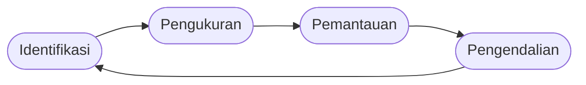
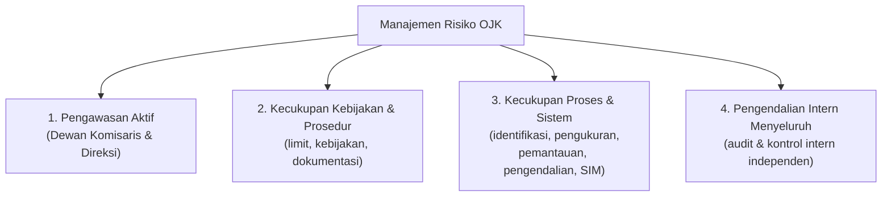
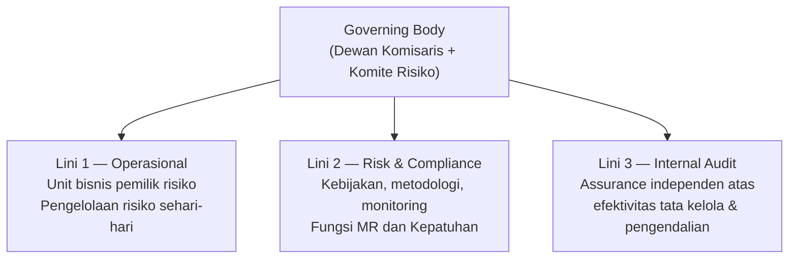
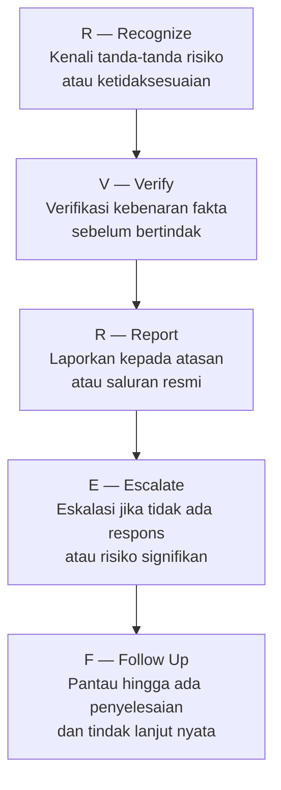
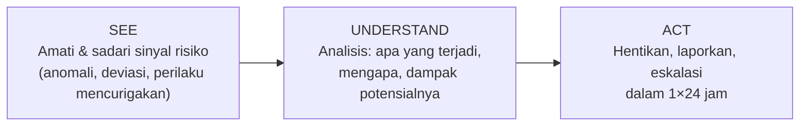
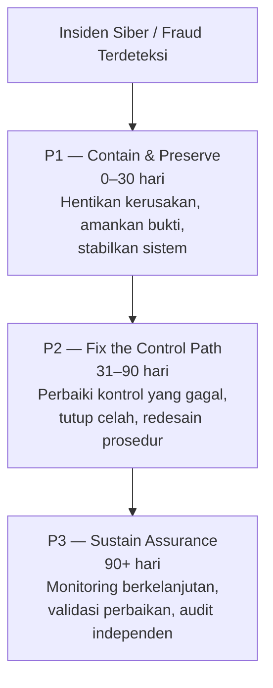

# Modul 3 — Manajemen Risiko

---

## Konsep Dasar Risiko

### Definisi dan Paradigma

- **Risiko** adalah kemungkinan terjadinya suatu peristiwa yang berdampak negatif terhadap pencapaian tujuan organisasi.
- **Manajemen Risiko** adalah serangkaian proses identifikasi, pengukuran, pemantauan, dan pengendalian risiko secara sistematis dan berkesinambungan.
- Paradigma modern: risiko bukan sekadar ancaman yang harus dihindari, melainkan variabel yang harus **dikelola secara aktif** agar organisasi dapat mencapai tujuannya dengan tepat.
- **Risk Universe** = keseluruhan spektrum risiko yang berpotensi mempengaruhi SJK, mencakup risiko internal dan eksternal.

### Identifikasi Konteks

Sebelum mengidentifikasi risiko, perlu ditetapkan:
- **Konteks eksternal**: lingkungan regulasi, pasar, sosial, teknologi.
- **Konteks internal**: struktur organisasi, tujuan, proses, budaya, kapabilitas.
- **Konteks manajemen risiko**: ruang lingkup, kriteria, metodologi yang digunakan.

### Identifikasi Risiko

- Teknik: brainstorming, wawancara, analisis skenario, review historis kerugian, checklist risiko.
- Output: **Risk Register** — daftar risiko yang teridentifikasi beserta deskripsi, penyebab, dan dampaknya.
- Risiko dikelompokkan berdasarkan **taksonomi risiko** yang berlaku di organisasi.

---

## Siklus Manajemen Risiko

4 tahap yang berulang secara berkesinambungan:

1. **Identifikasi** — Mengenali seluruh sumber, penyebab, dan jenis risiko yang dihadapi.
2. **Pengukuran** — Mengkuantifikasi besaran risiko berdasarkan kemungkinan dan dampak.
3. **Pemantauan** — Memonitor perkembangan profil risiko secara berkelanjutan.
4. **Pengendalian** — Menerapkan respons dan mitigasi terhadap risiko yang teridentifikasi.

---

## 4 Pilar Manajemen Risiko OJK

1. **Pengawasan Aktif** — Dewan Komisaris dan Direksi terlibat langsung dalam penetapan strategi dan kebijakan risiko.
2. **Kecukupan Kebijakan & Prosedur** — Tersedianya kebijakan, limit, dan prosedur yang memadai dan terdokumentasi.
3. **Kecukupan Proses & Sistem** — Proses identifikasi, pengukuran, pemantauan, pengendalian, dan sistem informasi MR yang memadai.
4. **Pengendalian Intern yang Menyeluruh** — Fungsi audit dan kontrol intern yang independen dan efektif.

---

## Pengukuran Risiko

### Skala Kemungkinan (Likelihood)

| Skor | Level | Deskripsi |
|------|-------|-----------|
| 1 | Sangat Jarang | < 1% kemungkinan terjadi dalam setahun |
| 2 | Jarang | 1–10% |
| 3 | Kadang | 11–40% |
| 4 | Sering | 41–70% |
| 5 | Sangat Sering | > 70% |

### Skala Dampak (Impact)

| Skor | Level | Deskripsi |
|------|-------|-----------|
| 1 | Tidak Signifikan | Dampak minimal, tidak mengganggu operasional |
| 2 | Kecil | Dampak kecil, bisa ditangani rutin |
| 3 | Sedang | Memerlukan intervensi manajemen |
| 4 | Besar | Mengganggu pencapaian tujuan utama |
| 5 | Katastrofik | Mengancam keberlangsungan organisasi |

### Matriks Risiko 5×5

- **Risk Score** = Kemungkinan × Dampak (skala 1–25)
- 5 level risiko:
  - **Sangat Rendah** (1–4): Biru — terima/monitor
  - **Rendah** (5–9): Hijau — monitor dengan prosedur standar
  - **Sedang** (10–14): Kuning — mitigasi aktif diperlukan
  - **Tinggi** (15–19): Oranye — eskalasi ke manajemen senior
  - **Sangat Tinggi** (20–25): Merah — tindakan segera, eskalasi ke Direksi/Dewan Komisaris

### Inherent Risk vs Residual Risk

- **Inherent Risk** = risiko sebelum kontrol diterapkan — dinilai berdasarkan kompleksitas bisnis dan kondisi eksternal.
- **Residual Risk** = risiko setelah kontrol diterapkan.
- Formula konseptual: **Residual Risk = Inherent Risk − Efektivitas Kontrol**
- **KPMR** (Kualitas Penerapan Manajemen Risiko) — penilaian atas efektivitas kontrol, menghasilkan adjustment dari inherent ke residual risk.
- Target: residual risk berada dalam batas **risk appetite** yang ditetapkan.
- Perbedaan antara keduanya menunjukkan **efektivitas sistem pengendalian** yang ada.

### RAROC (Risk-Adjusted Return on Capital)

- **RAROC** = (Pendapatan Bersih − Kerugian Ekspektasian) / Modal Ekonomi
- Digunakan untuk mengukur profitabilitas yang telah memperhitungkan risiko.
- Membantu pengambilan keputusan alokasi modal secara efisien.
- Aktivitas dengan RAROC di atas **hurdle rate** (biaya modal) dianggap menciptakan nilai.

### Stress Testing dan Analisis Skenario

- **Stress Testing** = simulasi dampak kondisi ekstrem terhadap keuangan dan risiko organisasi.
- **Scenario Analysis** = penilaian risiko dalam berbagai skenario hipotetis (baseline, adverse, severely adverse).
- Digunakan untuk menilai **ketahanan** (resilience) organisasi menghadapi guncangan.
- Wajib dilaporkan kepada otoritas pengawas (OJK) sebagai bagian dari ICAAP/ILAAP.

---

## Respons dan Mitigasi Risiko

4 opsi respons risiko:
1. **Avoid** (Hindari) — hentikan aktivitas yang menimbulkan risiko.
2. **Reduce/Mitigate** (Kurangi) — terapkan kontrol untuk menurunkan kemungkinan atau dampak.
3. **Transfer/Share** (Alihkan) — asuransi, outsourcing, hedging.
4. **Accept** (Terima) — risiko masih dalam selera risiko yang ditetapkan.

---

## Kerangka Three Lines Model

- **Lini 1 — Operasional**: Unit bisnis pemilik risiko, bertanggung jawab atas pengelolaan risiko sehari-hari.
- **Lini 2 — Risk & Compliance**: Fungsi manajemen risiko dan kepatuhan, menetapkan kebijakan, metodologi, monitoring.
- **Lini 3 — Internal Audit**: Memberikan assurance independen atas efektivitas tata kelola dan pengendalian risiko.
- Dewan Komisaris: mengawasi kebijakan risiko; Komite Risiko berada di bawah Dewan Komisaris.
- Direksi: menetapkan strategi risiko, memastikan pelaksanaan di seluruh lini.

---

## Risk Appetite dan Limit

### Risk Appetite Statement (RAS)

- **Risk Appetite** = jumlah dan jenis risiko yang **bersedia** ditanggung organisasi dalam mengejar tujuannya.
- **RAS** adalah pernyataan formal yang mendokumentasikan selera risiko dalam bentuk kualitatif dan kuantitatif.
- Hierarki selera risiko:
  1. **Risk Capacity** — batas maksimum risiko yang secara teknis **mampu** ditanggung (modal, likuiditas, reputasi).
  2. **Risk Appetite** — batas yang **bersedia** ditanggung (lebih rendah dari capacity).
  3. **Risk Tolerance** — variasi yang masih dapat diterima di sekitar appetite.
  4. **Operational Limits** — limit spesifik untuk portofolio/transaksi/aktivitas individual.

> Urutan hierarki: **Risk Capacity > Risk Appetite > Risk Tolerance > Operational Limits**

### Limit Cascading

- Limit ditetapkan secara **berjenjang** dari level enterprise ke unit bisnis ke individu:
  - **Enterprise Risk Limit** → **Business Unit Limit** → **Individual/Desk Limit**
- Setiap breach pada limit bawah harus dieskalasi ke atas sesuai SOP.

---

## Jenis-Jenis Risiko Utama SJK

| # | Jenis Risiko | Deskripsi |
|---|---|---|
| 1 | **Risiko Kredit** | Gagal bayar debitur/counterparty |
| 2 | **Risiko Pasar** | Kerugian akibat perubahan harga pasar (suku bunga, nilai tukar, harga saham, komoditas) |
| 3 | **Risiko Likuiditas** | Ketidakmampuan memenuhi kewajiban jatuh tempo tanpa kerugian signifikan |
| 4 | **Risiko Operasional** | Kerugian dari kegagalan proses, sistem, SDM, atau kejadian eksternal |
| 5 | **Risiko Kepatuhan** | Kegagalan mematuhi regulasi, hukum, atau standar yang berlaku |
| 6 | **Risiko Siber/Hukum** | Ancaman keamanan siber dan risiko tuntutan hukum |
| 7 | **Risiko Strategik** | Kerugian akibat keputusan bisnis yang tidak tepat atau kegagalan strategi |
| 8 | **Risiko Reputasi** | Dampak negatif terhadap nama baik dari pemberitaan, persepsi publik, atau kegagalan layanan |

---

## Key Risk Indicators (KRI) dan Pelaporan

### KRI — Traffic Light System

- **KRI** = metrik kuantitatif yang menjadi sinyal dini atas perubahan profil risiko.
- Sistem traffic light:
  - **Hijau/Green (Normal)** — dalam batas aman, tidak ada tindakan khusus.
  - **Kuning/Amber (Warning)** — mendekati threshold, perlu peningkatan monitoring dan tindakan preventif.
  - **Merah/Red (Breach)** — melampaui limit, wajib eskalasi dan tindakan korektif segera.
- KRI dikalibrasi secara periodik agar tetap relevan dengan kondisi bisnis.

### Pemantauan dan Pelaporan

- Pemantauan dilakukan secara **berkala** (harian, mingguan, bulanan) sesuai level risiko.
- **Risk Dashboard** — visualisasi profil risiko secara agregat per periodik.
- **Laporan Profil Risiko** — disampaikan kepada Direksi (bulanan) dan Dewan Komisaris (triwulanan).
- **Incident Report** — laporan atas kejadian kerugian operasional, disampaikan tepat waktu.
- **Regulatory Reporting** — laporan risiko kepada OJK sesuai POJK yang berlaku.
- **Eskalasi** wajib dilakukan jika risiko melebihi threshold/limit yang ditetapkan.

---

## Risk Maturity Model

4 level maturitas:

1. **Initial/Ad-hoc** — manajemen risiko reaktif, tidak sistematis, bergantung individu.
2. **Developing/Compliance** — kerangka dasar ada, penerapan masih parsial, didorong kepatuhan regulasi.
3. **Established/Integrated** — MR terintegrasi dalam proses bisnis, KRI dan RAS berjalan, budaya mulai terbentuk.
4. **Advanced/Value Creating** — MR sebagai keunggulan kompetitif, forward-looking, menciptakan nilai bagi organisasi.

### 3 Tingkat Maturitas Governance Risiko

1. **Existence** — kebijakan, struktur, dan prosedur sudah ada (tertulis).
2. **Implementation** — kebijakan dan prosedur sudah dijalankan dalam praktik sehari-hari.
3. **Effectiveness** — penerapan terbukti efektif dalam mengendalikan risiko dan mencapai tujuan.

---

## Budaya Risiko

4 fase evolusi budaya risiko:

1. **Compliance** — kepatuhan terhadap aturan karena kewajiban, bukan kesadaran.
2. **Integration** — MR mulai terintegrasi dalam pengambilan keputusan sehari-hari.
3. **Risk Aware** — seluruh karyawan memiliki kesadaran risiko yang tinggi, proaktif.
4. **Resilient** — organisasi mampu beradaptasi dan pulih cepat dari kejadian risiko.

---

## Anti-Fraud: POJK 12/2024

**4 Pilar Pencegahan dan Penanganan Fraud**:

1. **Pencegahan** — budaya anti-fraud, screening SDM, pelatihan, kebijakan konflik kepentingan, whistleblowing system.
2. **Deteksi** — surprise audit, surveillance system, KRI fraud, data analytics.
3. **Investigasi & Sanksi** — prosedur investigasi, kerjasama aparat hukum, penerapan sanksi tegas.
4. **Pemantauan & Evaluasi** — review berkala efektivitas program anti-fraud, pelaporan kepada manajemen dan regulator.

---

## R-V-R-E-F Framework

Kerangka tindak bagi pelaksana sebagai **Lini Pertahanan Pertama**:

| Tahap | Singkatan | Tindakan |
|-------|-----------|----------|
| 1 | **R — Recognize** | Kenali tanda-tanda risiko atau ketidaksesuaian |
| 2 | **V — Verify** | Verifikasi kebenaran fakta sebelum bertindak |
| 3 | **R — Report** | Laporkan kepada atasan atau saluran pelaporan resmi |
| 4 | **E — Escalate** | Eskalasi jika tidak ada respons atau risiko signifikan |
| 5 | **F — Follow Up** | Pantau hingga ada penyelesaian dan tindak lanjut nyata |

---

## Risk-Aware Action untuk Pelaksana

### Tiga Tingkat Kesadaran Risiko

1. **Awareness (Sadar)** — mengenali adanya risiko di sekitar lingkungan kerja.
2. **Understanding (Paham)** — memahami akar penyebab, konsekuensi, dan kontrol yang berlaku.
3. **Action (Bertindak)** — mengambil langkah yang tepat dan melaporkan risiko secara proaktif.

### SEE → UNDERSTAND → ACT

- **SEE** — amati dan sadari sinyal risiko di lingkungan kerja (anomali, deviasi, perilaku mencurigakan).
- **UNDERSTAND** — analisis: apa yang terjadi, mengapa bisa terjadi, apa dampak potensialnya.
- **ACT** — ambil tindakan yang tepat: hentikan, laporkan, eskalasi dalam **1×24 jam**.
- Prinsip: "Jika kamu melihat sesuatu, katakan sesuatu" — diam bukan pilihan.

### Kerangka Berpikir Analitik: FACT → SIGNAL → HYPOTHESIS → CONCLUSION

- **FACT** — kumpulkan fakta objektif yang dapat diverifikasi.
- **SIGNAL** — identifikasi sinyal/pola yang relevan dari fakta.
- **HYPOTHESIS** — bangun hipotesis berdasarkan sinyal yang ada.
- **CONCLUSION** — tarik kesimpulan yang didukung bukti dan ambil keputusan.

### Near Miss Reporting

- **Near miss** = kejadian yang berpotensi menimbulkan kerugian tetapi tidak terjadi (hampir terjadi).
- Wajib dilaporkan karena merupakan **sinyal dini** sebelum kejadian sesungguhnya.
- Budaya pelaporan near miss mencerminkan kematangan budaya risiko organisasi.
- Hambatan pelaporan: rasa malu, takut disalahkan, menganggap tidak penting — harus diatasi dengan budaya non-blame.

### Jalur Transmisi Risiko Eksternal

Risiko dari lingkungan eksternal (ekonomi makro, geopolitik, teknologi, regulasi baru) dapat **mentransmisikan** dampaknya ke dalam organisasi melalui:
- Nasabah/counterparty yang terdampak.
- Rantai pasokan dan mitra bisnis.
- Infrastruktur pasar keuangan bersama.
- Sentimen pasar dan kepercayaan publik.

Pelaksana perlu **waspada terhadap perubahan kondisi eksternal** yang dapat mempengaruhi risiko operasional sehari-hari.

---

## Insiden Siber: Lessons from a Financial Sector Cyber Incident

### Latar Belakang Kasus

- Kasus nyata (dianonimkan): transaksi fraud senilai **Rp 2,75 miliar** melalui saluran internal yang dipercaya.
- Pelaku memanfaatkan **trusted internal channel** — jalur yang secara historis dianggap aman dan tidak diverifikasi ulang.
- Fraud berhasil karena kontrol yang ada **tidak didesain untuk mendeteksi penyalahgunaan dari dalam** melalui jalur tepercaya.

### Temuan Utama Investigasi

- Kontrol teknis **ada** tetapi tidak efektif dalam praktik — mismatch antara desain dan operasionalisasi.
- Tidak ada **mekanisme verifikasi independen** untuk transaksi besar melalui saluran internal.
- Jejak bukti (evidence trail) tidak lengkap karena logging tidak memadai.
- Respons terlambat karena ketiadaan **eskalasi otomatis** saat anomali terdeteksi.

### 5 Dimensi Efektivitas Kontrol

1. **Design** — apakah kontrol dirancang dengan benar untuk mengatasi risiko yang dituju?
2. **Coverage** — apakah kontrol mencakup seluruh skenario risiko yang relevan?
3. **Operation** — apakah kontrol berjalan sebagaimana dirancang dalam praktik sehari-hari?
4. **Evidence** — apakah ada bukti yang cukup dan dapat diverifikasi bahwa kontrol berjalan?
5. **Resilience** — apakah kontrol tetap efektif saat sistem berada di bawah tekanan/serangan?

> Kontrol yang hanya memenuhi dimensi Design dan Coverage tetapi lemah pada Operation, Evidence, atau Resilience **tidak dianggap efektif**.

### Investigasi Berbasis Bukti

- Prinsip: **"Evidence speaks louder than assertions"** — setiap klaim harus didukung bukti konkret.
- Langkah investigasi:
  1. **Preserve** — amankan log dan bukti digital sebelum terdegradasi.
  2. **Collect** — kumpulkan data dari semua sumber relevan (sistem, saksi, dokumen).
  3. **Analyze** — analisis timeline kejadian dan titik kegagalan kontrol.
  4. **Report** — buat laporan faktual dengan temuan, akar masalah, dan rekomendasi.
- **Chain of custody** digital harus dijaga agar bukti dapat digunakan secara hukum.

### Risk Treatment Prioritization (P1/P2/P3)

| Prioritas | Label | Timeframe | Fokus |
|-----------|-------|-----------|-------|
| **P1** | Contain & Preserve | 0–30 hari | Hentikan kerusakan lebih lanjut, amankan bukti, stabilkan sistem |
| **P2** | Fix the Control Path | 31–90 hari | Perbaiki kontrol yang gagal, tutup celah, redesain prosedur |
| **P3** | Sustain Assurance | 90+ hari | Monitoring berkelanjutan, validasi efektivitas perbaikan, audit independen |

### Prinsip Trust Boundary dalam Cyber Risk

- **"Trust must be proven at every transaction"** — tidak ada entitas internal atau eksternal yang secara otomatis dipercaya.
- Konsep **Zero Trust Architecture**: verifikasi identitas, otorisasi, dan integritas data di setiap titik, bukan hanya di perimeter.
- Praktik: multi-factor authentication, segregation of duties, four-eyes principle untuk transaksi bernilai besar.
- Insider threat adalah risiko nyata — kontrol harus dirancang untuk mendeteksi penyalahgunaan dari dalam, bukan hanya serangan dari luar.

### Pelajaran untuk Pelaksana

- Jangan asumsikan saluran yang "sudah lama aman" masih aman hari ini.
- Anomali sekecil apapun harus dilaporkan — bukan hanya insiden besar.
- Dokumentasikan setiap tindakan dan keputusan terkait transaksi tidak biasa.
- Gunakan R-V-R-E-F: **Recognize** transaksi mencurigakan → **Verify** legitimasinya → **Report** kepada atasan → **Escalate** jika tidak ada respons → **Follow Up** hingga ada kejelasan.

---

## Ringkasan Kunci untuk Ujian

### Angka dan Formula Penting

| Item | Nilai/Formula |
|------|---------------|
| Jumlah pilar MR OJK | 4 pilar |
| Jumlah jenis risiko utama SJK | 8 jenis |
| Skala matriks risiko | 5×5, skor 1–25 |
| Jumlah level risiko di matriks | 5 level (Sangat Rendah s.d. Sangat Tinggi) |
| Jumlah level maturity model | 4 level |
| Jumlah pilar anti-fraud POJK 12/2024 | 4 pilar |
| Jumlah fase budaya risiko | 4 fase |
| Dimensi efektivitas kontrol | 5 dimensi |
| Prioritas risk treatment | P1 (0–30 hr), P2 (31–90 hr), P3 (90+ hr) |
| Nilai transaksi fraud kasus siber | Rp 2,75 miliar |
| Batas waktu ACT dalam SEE→UNDERSTAND→ACT | 1×24 jam |
| RAROC formula | (Pendapatan Bersih − EL) / Modal Ekonomi |
| Residual Risk | Inherent Risk − Efektivitas Kontrol |

### Regulasi Kunci

- **POJK 12/2024** — Pencegahan dan Penanganan Fraud di SJK (4 pilar anti-fraud).
- **Basel Framework** — standar internasional untuk permodalan dan manajemen risiko perbankan.
- **IIA Three Lines Model** — standar global governance tiga lini pertahanan.

### Konsep yang Sering Diujikan

- Urutan hierarki: Risk Capacity > Risk Appetite > Risk Tolerance > Operational Limits
- Perbedaan Inherent Risk vs Residual Risk
- 3 Lini dalam Three Lines Model dan peran masing-masing
- Beda KRI Green/Amber/Red dan tindakan yang diperlukan
- R-V-R-E-F sebagai kerangka tindak pelaksana
- SEE → UNDERSTAND → ACT dengan batas waktu 1×24 jam
- 5 dimensi efektivitas kontrol: Design, Coverage, Operation, Evidence, Resilience
- "Trust must be proven at every transaction" — prinsip Zero Trust
